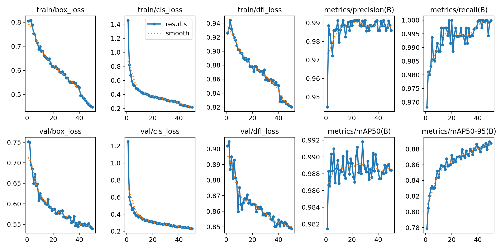

# ⚽ JuggleNet 🧠

> **AI-powered football juggling detector using YOLOv8**

JuggleNet is a Computer Vision project that tracks a football and your lower body landmarks to detect and count juggles. 

<p align="center">
  
</p>

---

## 🚀 Features

- ✅ **Ball Detection** with **Fine-Tuned** YOLOv8
- 🦿 **Body Pose Estimation** with MediaPipe (hips, knees, feet)
- 🧮 **Smoothed Estimation** via Kalman Filter
- 📈 **Live Graphing** of ball Y-position
- 🧠 **Juggle Detection Logic** using physics-inspired heuristic
- 🔁 Works on **webcam or video input**
- 🎨 Visual overlay showing keypoints, bounding boxes, and live counts

---

## 🗂️ Project Structure
```
.
├── utils/
│   ├── draw_POI.py         # Draw POI landmarks
│   ├── plot_graph.py       # Plot ball Y-position
│   ├── update_predict.py   # Update measurements, perform predictions
│   ├── juggle_counter.py   # Count juggles
│   ├── Kalman1D.py         # 1D Kalman Filter
│   └── vision_estimate.pt  # Extract POIs via vision pipeline
├── models/
│   └── best.pt             # Fine-tunes YOLOv8 model
├── source_data/
│   └── Vid1.mp4            # Example input video
├── save/
│   └── Vid1_Analysed.mp4   # Analysed example video
├── main.py                 # Main driver script
└── README.md               # Project documentation
```

## 🧰 Getting Started

### 1. Clone the repo

```bash
git clone https://github.com/yourusername/jugglenet.git
cd jugglenet
```

### 2. Install Dependencies
```bash
pip install -r requirements.txt
```

### 3. Run Script
```bash
python main.py --video <your_video> --save <your_save_directory>
```

## 🏋️ Fine-Tuning YOLO for Football Detection

To accurately detect the football in various lighting and motion conditions, we fine-tuned a lightweight YOLO model on a custom dataset.

⚙️ Model Details

 - Base model: YOLOv8n (Ultralytics)
 - Task: Object detection (1 class: football)
 - Training size: 2541 labeled images
 - Hardware: GTX 1650, 4GB VRAM

🗂️ Dataset

 - Original Source: [Juggling Computer Vision Project](https://universe.roboflow.com/football-bjlgx/juggling-xfitx)
 - Final Fine-Tuning Source: [Football Detection](https://app.roboflow.com/lokran/football-detector-bt79i/1)

🧹 Pre-Processing

 - Original classes: 3 (Football, Person, Foot)
 - Preprocessing: Filtered to retain only the football class, cleaned up annotations for football

🧪 Training Configuration

```bash
yolo task=detect \
     mode=train \
     model=yolov8n.pt \
     data=<finetune_data_directory> \
     epochs=50 \
     imgsz=640 \
     batch=8 \
```

<p align="center">
  
</p>

## 🛠️ TODO
- [ ] Add acceleration (gravity) to Kalman Filter for more realistic estimations (linear velocity is not accurate)
- [ ] Improve juggle logic by using a 1D CNN
- [ ] Comparison between untuned YOLO and finetuned YOLO